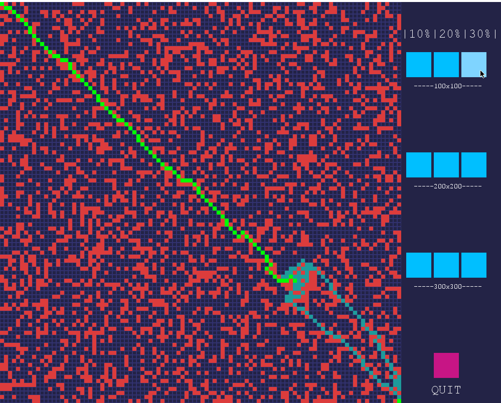

[](https://repl.it/github/jeremiahbaclig/A-Star_FinalProj)

# A-Star_FinalProj
ARA* (Anytime Repairing A*) Visualization with GUI using PyGame.

Grid generation of 100x100, 200x200, and 300x300 are available to choose from, along with percentage of obstacles which ranges from 10%, 20%, and 30%. 
The starting point will be the first block in the top left corner, and the fastest path, chosen neighbors based on an f score of g (euclidean distance) 
plus h (manhattan distance) or, will be navigated alongside a weight (w0) for iterations and a decrementing inflation factor (e). 

``` f = g + e*h ```

To run it, either visit the repl.it page, or download the files and run visualization.py.

**Sample output:** 
